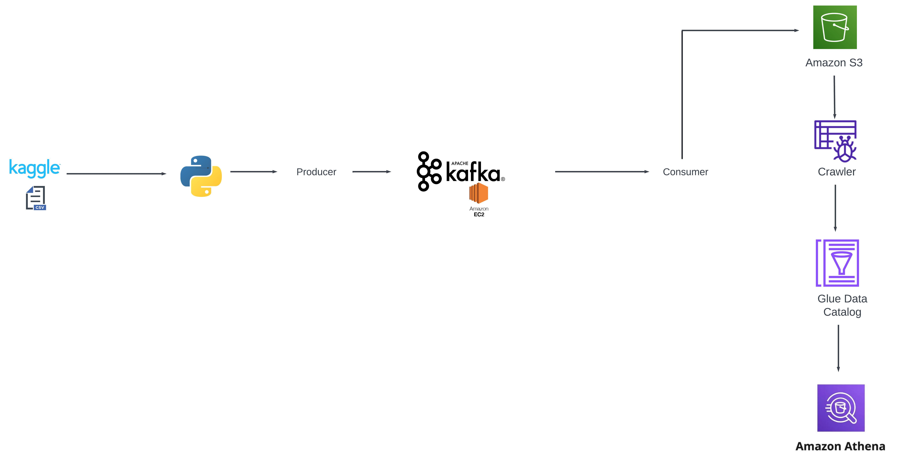

## Project Introduction: Real-Time Data Pipeline for Analytics using Apache Kafka and AWS

In today's data-driven world, organizations rely heavily on real-time data analytics to make informed decisions. This project focuses on building a robust, scalable, and real-time data processing pipeline that ingests data from various sources, processes it, and stores it in a format suitable for analytical queries. The architecture leverages a combination of Apache Kafka for real-time data streaming and various AWS services for data storage, cataloging, and querying.

## Architecture

## Project Overview

The project demonstrates the integration of real-time data ingestion, processing, and analytics using the following key components:

**Data Source (Kaggle CSV Datasets):**

The initial data source for this pipeline is a CSV dataset obtained from Kaggle. This dataset contains valuable information that needs to be processed and analyzed in real time.

**Data Ingestion (Python Producer):**

A Python-based producer is developed to read the data from the Kaggle CSV file and stream it to an Apache Kafka topic. The producer script is responsible for parsing the CSV data and pushing it into Kafka, ensuring that the data is available for real-time processing.

**Data Streaming (Apache Kafka on EC2):**

Apache Kafka, hosted on an Amazon EC2 instance, serves as the core of the data streaming layer. Kafka efficiently handles the incoming data stream, providing a reliable and scalable platform for real-time data ingestion. The data is organized into topics, which can be consumed by one or more consumers for further processing.

**Data Consumption (Kafka Consumer):**

A Kafka consumer listens to the Kafka topic, consuming the data as it arrives. This consumer processes the data and then prepares it for storage in Amazon S3, ensuring that the data is stored in a durable and accessible manner.

**Data Storage (Amazon S3):**

The processed data is stored in Amazon S3, a scalable and secure object storage service. S3 acts as the central repository for the data, enabling other AWS services to access and process the stored data.

**Data Cataloging (AWS Glue Crawler and Data Catalog):**

AWS Glue, with its built-in Crawler, is used to automatically discover the data schema stored in S3. The crawler scans the data and creates a metadata catalog in the AWS Glue Data Catalog, which serves as a centralized metadata repository, making the data easily discoverable and queryable.

**Data Querying and Analytics (Amazon Athena):**

Amazon Athena, an interactive query service, is used to perform real-time SQL queries on the data stored in S3. Athena leverages the metadata cataloged by AWS Glue, enabling seamless and efficient querying of the data without the need for any additional infrastructure.

## Key Benefits

**Real-Time Processing**: The architecture ensures that data is ingested and made available for analysis in real time, providing immediate insights.

**Scalability**: Both Kafka and AWS services such as S3 and Glue are highly scalable, allowing the architecture to handle growing volumes of data efficiently.

**Cost-Efficiency**: By using managed services like AWS Glue and Athena, the project minimizes the overhead associated with maintaining data processing infrastructure.

**Flexibility**: The modular nature of the architecture allows for easy integration with other data sources and processing tools as needed.

## Use Cases:

**Real-Time Analytics**: The architecture is suitable for use cases where real-time data analytics is critical, such as financial market analysis, social media monitoring, and IoT data processing.

**Data Lake Integration**: The solution can be integrated with a data lake for long-term storage and batch processing of large datasets.

**Event-Driven Applications**: The pipeline can be extended to support event-driven applications that require immediate responses to incoming data streams.

